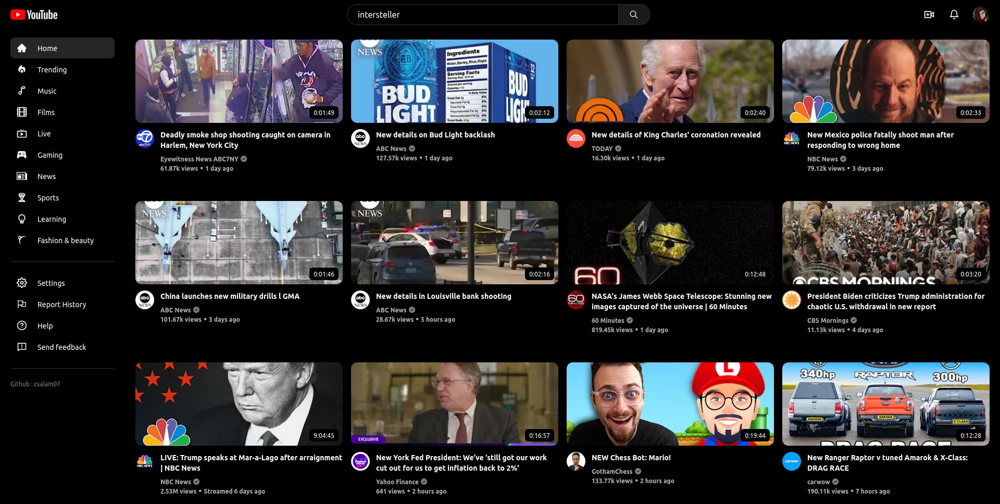
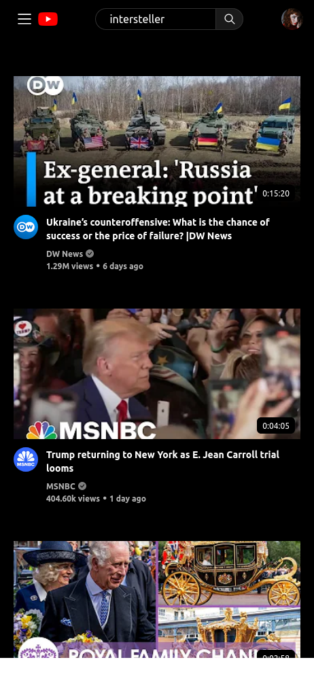
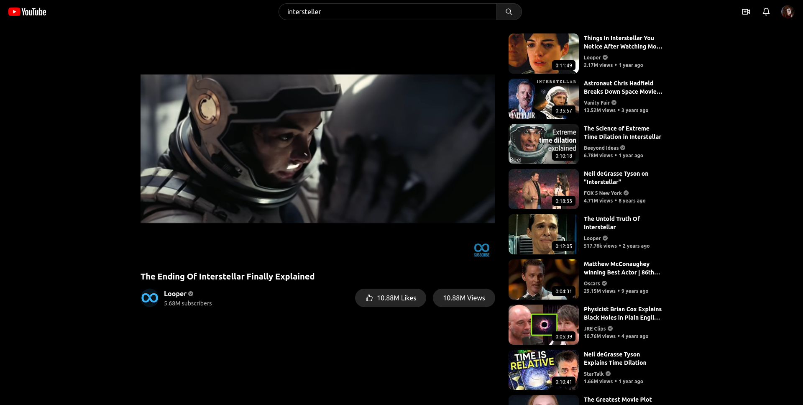

# YouTube Clone

This is a YouTube clone created using React, Tailwind CSS,context API and powered by the RAPID API (test subscription). The website allows users to search for YouTube videos and view them in a similar layout to the YouTube website.



## Features

- Search for YouTube videos using the RAPID API
- View video results in a similar layout to the YouTube website
- Responsive design that works on mobile, tablet, and desktop devices

## Getting Started

To get started, clone this repository to your local machine:

```bash
  git clone https://github.com/csalam07/youtube.git
```

Once you have cloned the repository, you can install the dependencies and start the development server:

```bash
  cd youtube
  yarn
  yarn start
```

This will start the development server and open the website in your default browser at http://localhost:3000.

## Deploying to Vercel

To deploy the website to Vercel, you can follow these steps:

1. Sign up for a Vercel account at https://vercel.com/signup.
2. Install the Vercel CLI by running npm i -g vercel.
3. Run vercel login to log in to your Vercel account.
4. Run vercel init to create a new Vercel project.
5. Follow the prompts to configure your project.
6. Run vercel --prod to deploy the website to Vercel.

## Environment Variables

To run this project, you will need to sign up for a free test subscription at https://rapidapi.com/marketplace.

Once you have a test subscription, you can create a .env file in the root of the project, and set the following environment variables:

`REACT_APP_YOUTUBE_API_KEY`=your_api_key_here

## Screenshots





